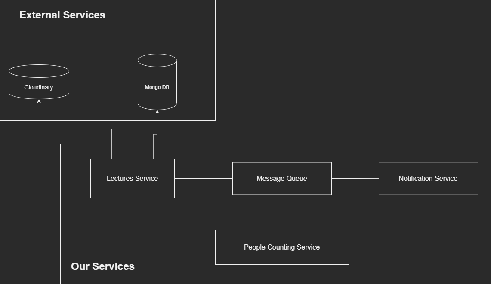
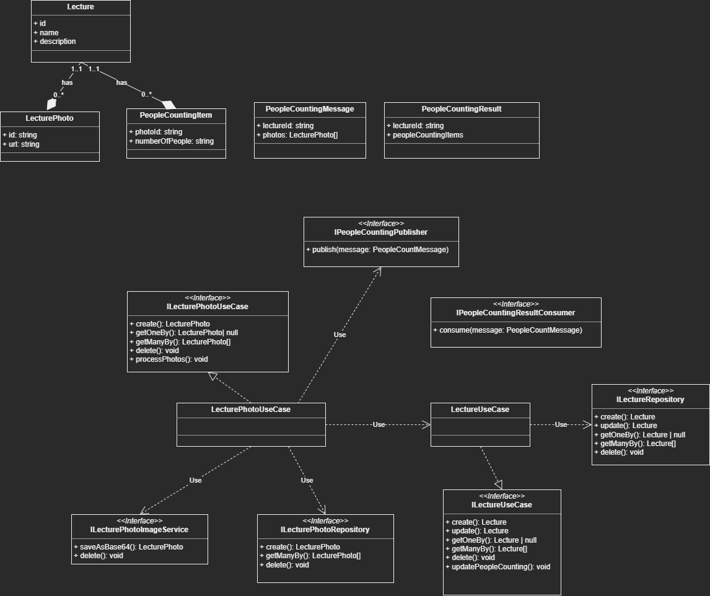
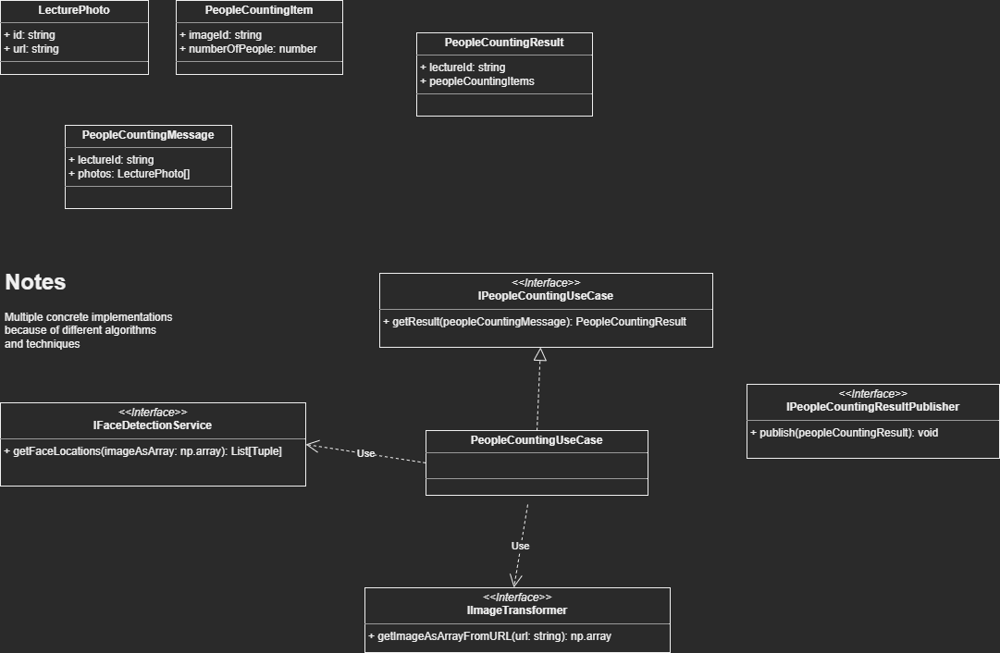

# Evepcount

evepcount is a lecture and events people counting system. Using the application you can create events with name, description and other relevant information. An event can contain multiple photos, you can select some photos to extract the number of people that are in it

## Motivation

My main motivation was building a project to learn message queues. I picked a people counting system because AI services are not instantaneous and take some time to process and return a response. Note: The implementation of counting people in images is just a simple HOG face recognition algorithm

## Run App

```
docker compose up
```

## Services



### Lectures Service (LS)

Handle CRUD operations for lecture entities. It uses an external mongodb database, so there is no need to deploy a mongodb instance

Note: API run on port 8000



### People counting Service (PCS)

In charge of processing messages for counting people in a photo. This service is built using python 3.9



## What I learned

- Docker, Docker images and docker compose
- RabbitMQ and message queues basics
